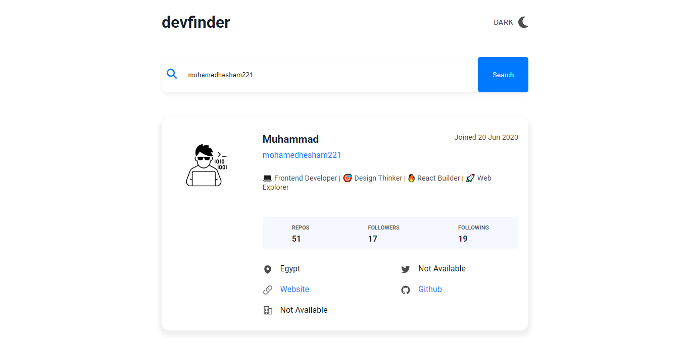
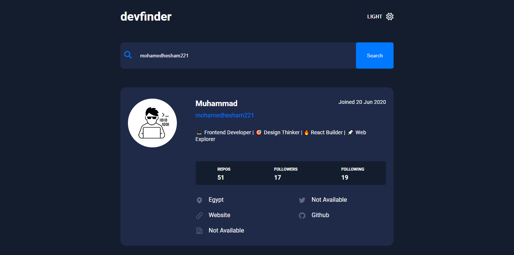

# **Devfinder**

## **Table of Contents**

- [About the Project](#about-the-project)  
- [Demo](#demo)  
- [Features](#features)  
- [Technologies Used](#technologies-used)  
- [Getting Started](#getting-started)  
  - [Prerequisites](#prerequisites)  
  - [Installation](#installation)  
- [Contact](#contact)

---

## **About the Project**  

>DevFinder is a responsive ReactJS application that helps users search for GitHub profiles by username. It fetches and displays profile details such as repositories, followers, following count, and other key information. The app features a clean, user-friendly interface, making it easy to explore developer profiles on GitHub.

---

## **Demo**  

### Screenshots

#### Light Mode



#### Dark Mode



### Live

[Preview](https://devfinder2024.vercel.app/)

---

## **Features**  

- Search GitHub profiles by username  
- View profile details, including bio, location, and public repositories  
- Responsive design for all devices  
- Dark and light theme modes  

---

## **Technologies Used**  

List the main technologies, frameworks, or libraries used in the project.  
Example:  

- ReactJS  

---

## **Getting Started**

### **Prerequisites**  

What tools/software are required to run the project?  

```bash
# Example:
- `Node.js >= 14`  
- `npm >= 6`
```

### **Installation**

#### Clone the repository

`git clone <https://github.com/mohamedhesham221/devfinder2024>`

#### Navigate to the project directory

`cd repository`

#### Install dependencies

`npm install`

#### Start the development server

`npm start`

## Contact

Muhammad Hisham

- 📄 Portfolio: <https://muhammadhisham2024.netlify.app/>
- 🔗 LinkedIn: <https://www.linkedin.com/in/muhammad-hisham-23544b253/>
- 🐙 GitHub: <https://github.com/mohamedhesham221>
- 📧 Email: <muhammedheshamm2@gmail.com>
